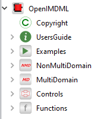
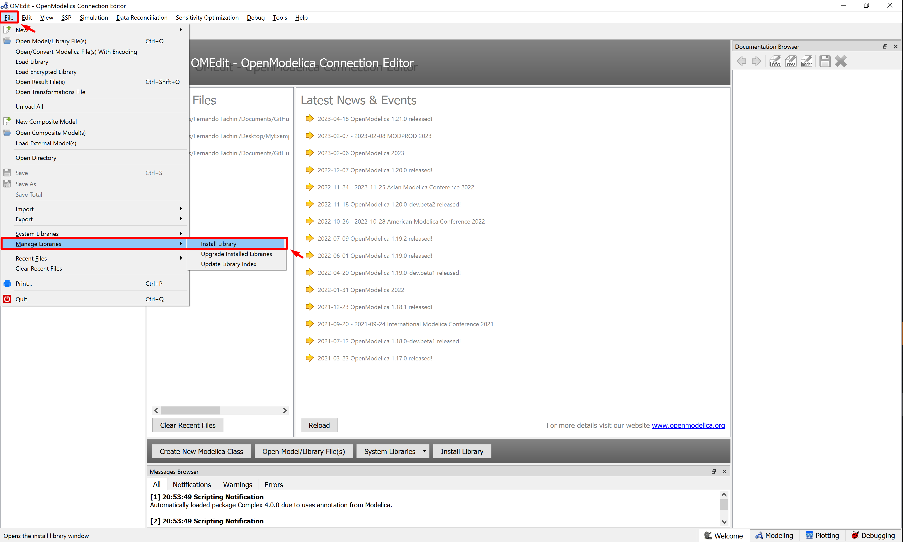
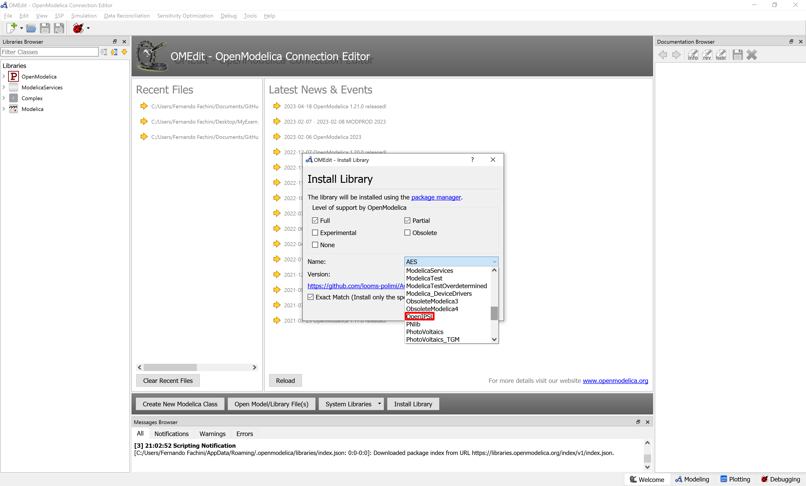
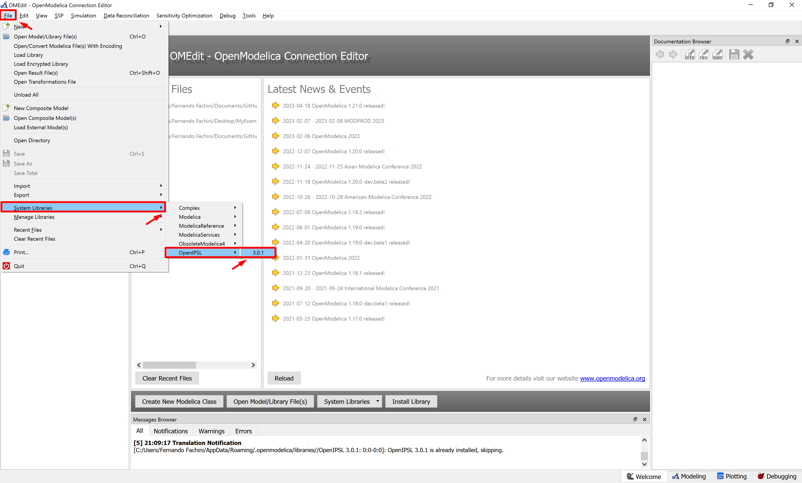
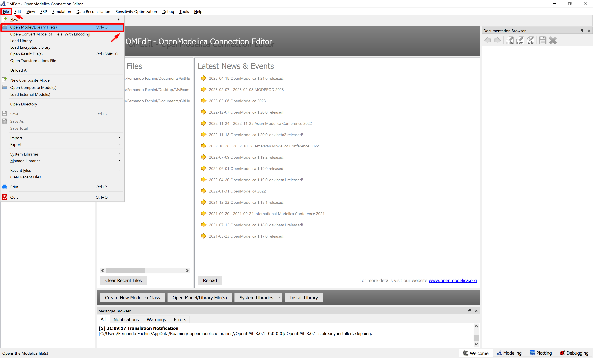
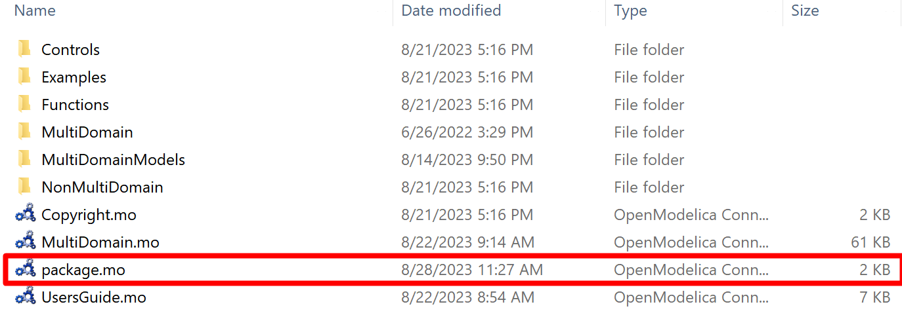
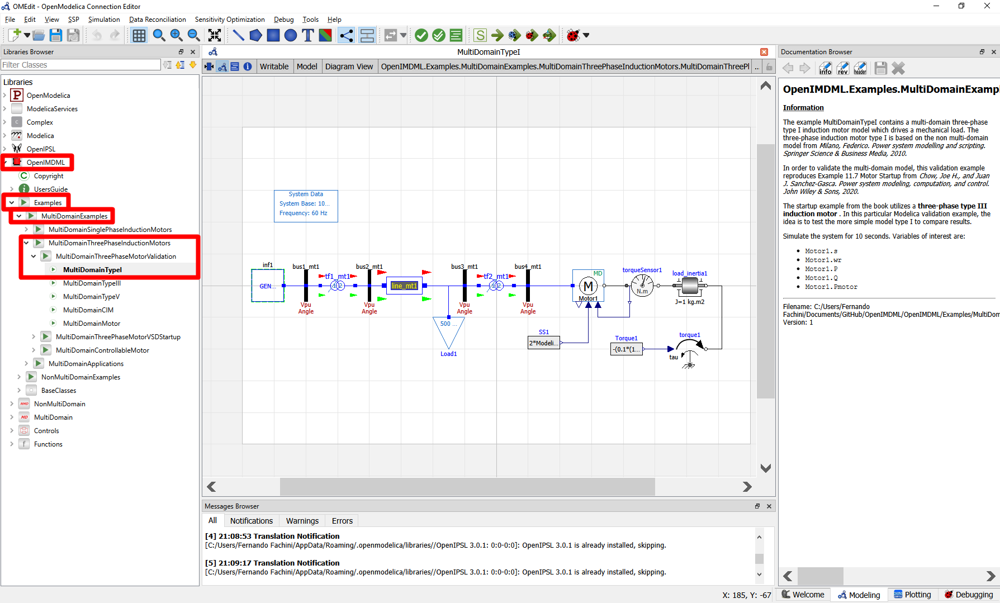
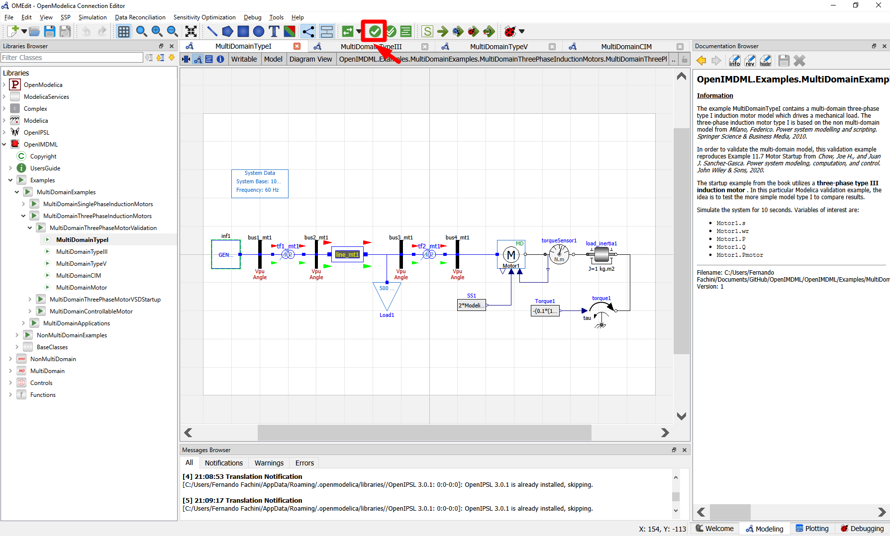
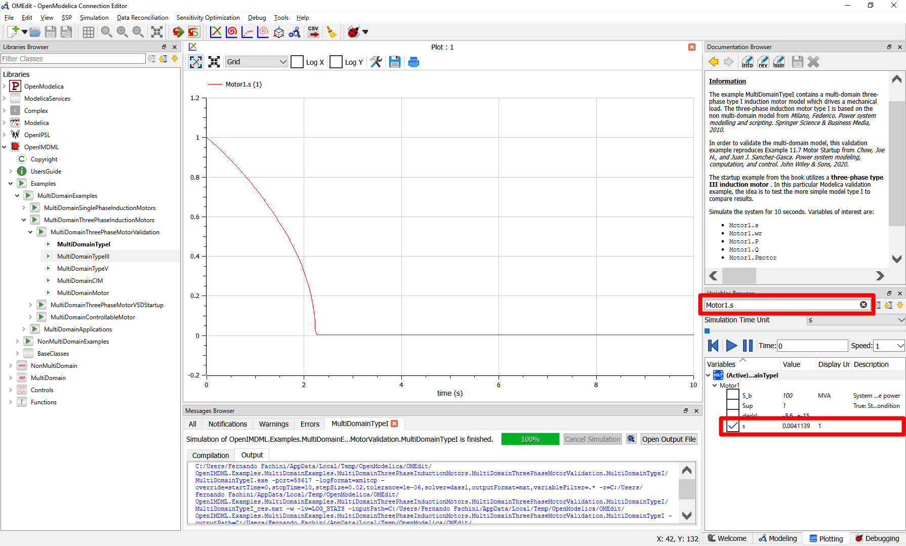

# OpenIMDML - Open Instance Multi-Domain Motor Library
## Scope
The OpenIMDML is an open-source Modelica-based library that is focused on modeling and simulation of induction motor models in the phasor domain. It was built using the Modelica language, leveraging the Modelica Standard Library, and functions in conjunction with [OpenIPSL](https://github.com/OpenIPSL/OpenIPSL). The library contains an extensive selection of single-phase and three-phase induction motor models, both in multi-domain and non-multi-domain modeling representation, and a variable speed drive model that is not modeled in traditional power system tools but is ubiquitously used in startup and operation of induction motors.
### Citing OpenIMDML in Publications
If you use OpenIMDML in your work or research, all we ask in exchange is that you cite the reference publications according to your use. Preferably, please cite this repository by using our preferred reference, as seen on the GitHub GUI.

If you use our library, please reference our work:

- Fachini, Fernando, et al, "Modeling of Induction Motors and Variable Speed Drives for Multi-Domain System Simulations Using Modelica and the OpenIPSL Library." Electronics 2024, 13, 1614. [https://doi.org/10.3390/electronics13091614](https://doi.org/10.3390/electronics13091614)
- Fachini, Fernando, et al, "Modeling of Induction Motors and Variable Speed Drives for Multi-Domain System Simulations Using Modelica and the OpenIPSL Library." Electronics 2024, 13, 1614. [https://doi.org/10.3390/electronics13091614](https://doi.org/10.3390/electronics13091614)
- Fachini, Fernando, et al, "Multi-Domain Power and Thermo-Fluid System Stability Modeling using Modelica and OpenIPSL," 2022 IEEE Power & Energy Society General Meeting (PESGM), Denver, CO, USA, 2022, pp. 1-5, doi: 10.1109/PESGM48719.2022.9917073.

## Documentation
### Theory and Implementation
Theory and implementation of the models in this library is presented in the following open-access paper"
- Fachini, Fernando, et al, "Modeling of Induction Motors and Variable Speed Drives for Multi-Domain System Simulations Using Modelica and the OpenIPSL Library." Electronics 2024, 13, 1614. [https://doi.org/10.3390/electronics13091614](https://doi.org/10.3390/electronics13091614)

### Built-in Documentation
The information/documentation view of each model provides abridged documentation of the models, you can access them from the information/documentation tab of your Modelica tool of choice.

## OpenIMDML Library Structure
The library is structured into five sub-packages (illustrated in Figure shown below): Examples, NonMultiDomain, MultiDomain, Controls, and Functions.\

- **Examples:** contains Modelica model examples of all the components and models developed in the OpenIMDML Library. The **Examples** package contains three sub-packages, namely **MultiDomainExamples**, **NonMultiDomainExamples**, and **BaseClasses**. The **MultiDomainExamples** sub-package presents examples of the single-phase and three-phase multi-domain motor developed in the library, including motor validation examples, examples including a variable speed drive and its controls, and a simple example of a multi-domain motor interacting with a pump that fills up a reservoir. The **NonMultiDomainExamples** sub-package contains examples of single-phase and three-phase non multi-domain motor models from the library, including examples that incorporate the variable speed drive. The difference between multi-domain and non multi-domain is linked to the driven load representation. Lastly, the **BaseClasses** sub-package contains partial models that are re-utilized in several of the examples from the package.
- **NonMultiDomain:** contains single-phase and three-phase non multi-domain induction motor models.
-  **MultiDomain:**  contains single-phase and three-phase multi-domain induction motor models.
-  **Controls:** contains power electronics and controller logic models for the variable speed drive model.
-  **Functions:** contains one function that implements an iterative method for estimating the induction motor equivalent circuit parameters using only the motor nameplate data.

## How to run an example in OpenModelica?

### **Step 1.** Download and Install OpenModelica 
OpenModelica is an open-source and free Modelica-based modeling and simulation environment intended for industrial and academic usage. To download the latest version of the software, click on: [Windows Version](https://openmodelica.org/download/download-windows/) or [Linux Version](https://openmodelica.org/download/download-linux/).

### Step 2. Installing OpenIPSL
Once you have OpenModelica open in your computer, click on *File>Manage Libraries>Install Library*

 
Search for OpenIPSL and click ok

### Step 3. Loading OpenIPSL and OpenIMDML
Now you should load OpenIPSL by going to *File>System Libraries>OpenIPSL>3.0.1*

In order to load OpenIMDML, you have to know the folder where you downloaded the library. You should go to *File>Open Model/Library File(s)* and search for the folder where you downloaded OpenIMDML. Once you have found the folder, you must load the **package.mo** file.

### Step 4. Running an Example
Now that you have loaded both OpenIPSL and OpenIMDML, we can start running some examples.
Under Libraries Browser, click on *OpenIMDML>Examples>MultiDomainExamples>MultiDomainThreePhaseInductionMotors>MultiDomainThreePhaseMotorValidation>MultiDomainTypeI*. You should expect to see the screen below. On the right-hand side of the figure below is the Documentation Browser, where the user can read more about the selected example.

Next step is to click on *Simulate*.

To display the simulation results, you must type the name of the variable you wish to plot. Use the names of the variables of interest from the Documentation Browser to select a variable to plot.
For instance, type in Variables Browser the variable **Motor1.s** and then select the variable. The plot displayed is the motor slip value.

## Copyright and License Information

**OpenIMDML:** Copyright August 2023 - current, [Fernando Fachini](https://github.com/fachif) and [Luigi Vanfretti](https://github.com/lvanfretti), [ALSETLab](https://github.com/ALSETLab), Rensselaer Polytechnic Institute, Troy, NY.

The authors can be contacted by email: <a href="mailto:emaildofachini@gmail.com?subject=OpenIMDML_License">emaildofachini@gmail.com</a>.

This Source Code Form is subject to the terms of the [3-Clause BSD license](https://opensource.org/licenses/BSD-3-Clause).

## Acknowledgements

The development of the OpenIMDML library is based upon work supported by the U.S. Department of Energy’s Office of Energy Efficiency and Renewable Energy (EERE) under the Advanced Manufacturing Office, Award Number DE-EE0009139.
