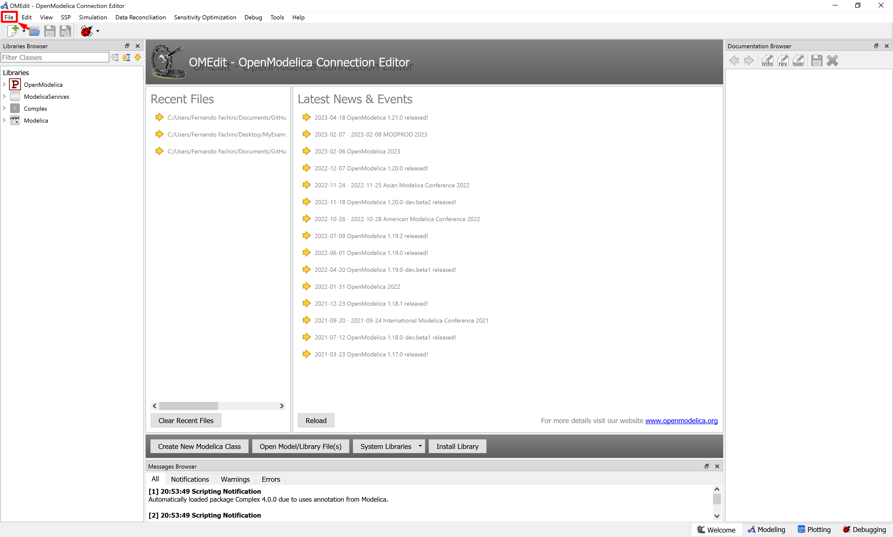

# OpenIMDML - Open Instance Multi-Domain Motor Library
## Scope
The OpenIMDML is an open-source Modelica-based library that is focused on modeling and simulation of induction motor models in the phasor domain. It was built using the Modelica language, leveraging the Modelica Standard Library, and functions in conjunction with [OpenIPSL](https://github.com/OpenIPSL/OpenIPSL). The library contains an extensive selection of single-phase and three-phase induction motor models, both in multi-domain and non-multi-domain modeling representation, and a variable speed drive model that is not modeled in traditional power system tools but is ubiquitously used in startup and operation of induction motors.
### Citing OpenIMDML in Publications
If you use OpenIMDML in your work or research, all we ask in exchange is that you cite the reference publications according to your use. Preferably, please cite this repository by using our preferred reference, as seen on the GitHub GUI.

We have submitted a paper to the SoftwareX journal, which we would welcome you to cite as:

> Fachini, Fernando, et al. "OpenIMDML: Open Instance Multi-Domain Motor Library utilizing the Modelica Modeling Language." SoftwareX (2023)

Previous work leading to the library has been published and can also be cited as:
> Fachini, Fernando, et al. "Multi-domain power and thermo-fluid system stability modeling using modelica and openipsl." 2022 IEEE Power & Energy Society General Meeting (PESGM). IEEE, 2022.

## OpenIMDML Library Structure
The library is structured into five sub-packages (illustrated in Figure shown below): Examples, NonMultiDomain, MultiDomain, Controls, and Functions.\

- **Examples:** contains Modelica model examples of all the components and models developed in the OpenIMDML Library.
- **NonMultiDomain:** contains single-phase and three-phase non multi-domain induction motor models.
-  **MultiDomain:**  contains single-phase and three-phase multi-domain induction motor models.
-  **Controls:** contains power electronics and controller logic models for the variable speed drive model.
-  **Functions:** contains one function that implements an iterative method for estimating the induction motor equivalent circuit parameters using only the motor nameplate data.

## How to run an example in OpenModelica?

### **Step 1.** Download and Install OpenModelica 
OpenModelica is an open-source and free Modelica-based modeling and simulation environment intended for industrial and academic usage. To download the latest version of the software, click on: [Windows Version](https://openmodelica.org/download/download-windows/) or [Linux Version](https://openmodelica.org/download/download-linux/).

### Step 2. Install the OpenIPSL Library
Once you have OpenModelica open in your computer, click on File:

## Copyright and License Information

**OpenIMDML:** Copyright August 2023 - current [Luigi Vanfretti](https://github.com/lvanfretti), [ALSETLab](https://github.com/ALSETLab), Troy, NY (Formely SmarTS Lab, Stockholm, Sweden).

The authors can be contacted by email: <a href="mailto:emaildofachini@gmail.com?subject=OpenIMDML_License">emaildofachini@gmail.com</a>.

This Source Code Form is subject to the terms of the [3-Clause BSD license](https://opensource.org/licenses/BSD-3-Clause).

## Acknowledgements

The development of the OpenIMDML library is based upon work supported by the U.S. Department of Energy’s Office of Energy Efficiency and Renewable Energy (EERE) under the Advanced Manufacturing Office, Award Number DE-EE0009139.
